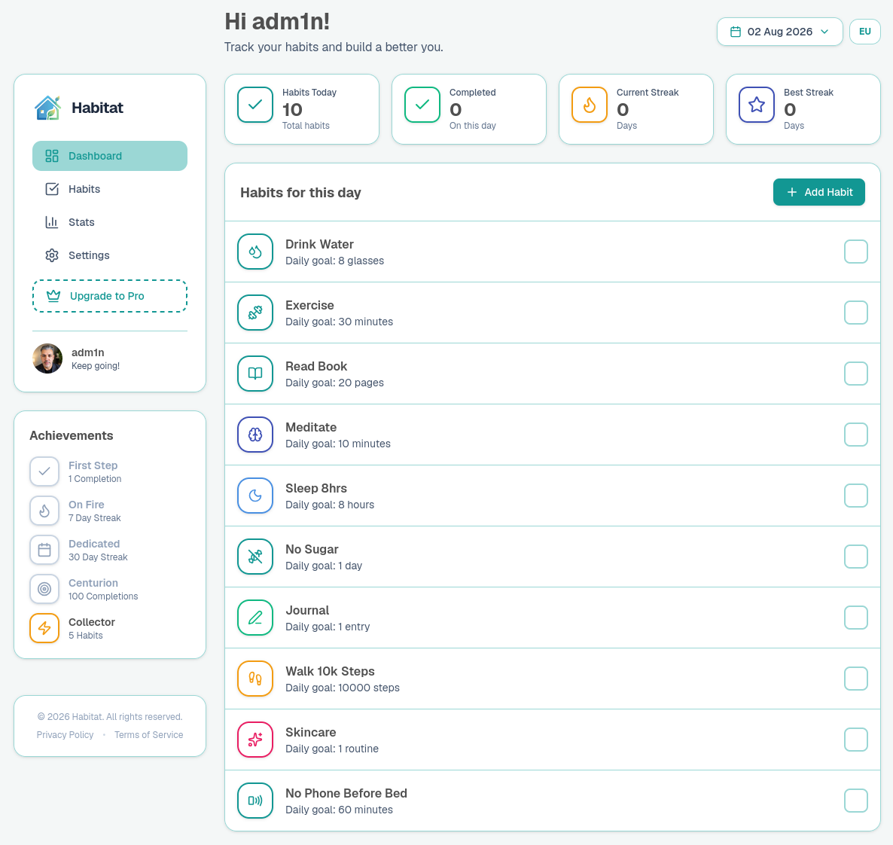

# Habitat — Build Better Habits

A full-stack habit tracking application. Track daily habits, maintain streaks, unlock achievements, and visualize your consistency over time.


## Live Demo

**https://habitat-red.vercel.app**

Try it instantly with the demo account:

| Email | Password |
|-------|----------|
| `demo@habitat.app` | `Demo1234!` |

## Screenshots



## Features

- **Dashboard** — track daily habits with a clean, grid-based interface
- **Habit Management** — create, edit, and delete habits with custom icons and colors
- **Streak Tracking** — current and best streaks per habit
- **Statistics** — charts showing completion rates and progress over time
- **Achievements** — unlock milestones as you build consistency
- **Date Navigation** — manage habits for any day (US/EU formats)
- **Authentication** — secure email/password login with NextAuth (bcrypt-hashed)
- **User Profiles** — nicknames, custom avatars (upload or generic)
- **Data Export** — download your full history as CSV
- **Desktop Notifications** — opt-in browser reminders
- **Responsive** — mobile sidebar, hamburger menu, touch-friendly controls

## Tech Stack

- **Framework**: Next.js 16 (App Router, Server Actions, Turbopack)
- **Language**: TypeScript
- **Styling**: Tailwind CSS v4
- **Database**: PostgreSQL with Prisma ORM
- **Auth**: NextAuth v4 (credentials provider, JWT sessions)
- **Charts**: Recharts
- **Icons**: Lucide React
- **Hosting**: Vercel + Neon PostgreSQL

## Project Structure

```
app/
├── components/       # Reusable UI components
├── habits/           # Habit management page
├── stats/            # Statistics page
├── settings/         # Profile settings page
├── pricing/          # Pricing page
├── api/              # Route handlers (auth, CSV export)
└── actions.ts        # Server actions (habit CRUD, auth, profile)
auth.ts               # NextAuth configuration
lib/
├── prisma.ts         # Prisma client singleton
└── streaks.ts        # Streak calculation logic
prisma/
└── schema.prisma     # Database schema & migrations
```

## Getting Started

### Prerequisites

- Node.js 18+
- A PostgreSQL database (e.g. [Neon](https://neon.tech))

### 1. Clone & install

```bash
git clone https://github.com/Vojislav77/habitat.git
cd habitat
npm install
```

### 2. Set up environment variables

```bash
cp .env.example .env
```

Then fill in the values:

| Variable | Description |
|----------|-------------|
| `DATABASE_URL` | PostgreSQL connection string |
| `NEXTAUTH_SECRET` | Session signing key (`openssl rand -base64 32`) |
| `NEXTAUTH_URL` | App URL (e.g. `http://localhost:3000`) |

### 3. Set up the database

```bash
npx prisma migrate dev
npx prisma generate
```

### 4. Run the dev server

```bash
npm run dev
```

Open [http://localhost:3000](http://localhost:3000).

## Available Scripts

| Command | Description |
|---------|-------------|
| `npm run dev` | Start the development server |
| `npm run build` | Create a production build |
| `npm start` | Run the production server |
| `npm run lint` | Run ESLint |
| `npx prisma migrate deploy` | Apply migrations in production |

## Database Schema

- **User** — credentials, profile, `isPro`, notification preferences
- **Habit** — title, icon, color, target value, unit, frequency, priority
- **HabitLog** — per-day completion status (`@@unique([habitId, date])`)
- **Account / Session / VerificationToken** — NextAuth OAuth session records

## Deployment

The app is deployed on Vercel with a Neon PostgreSQL database. Environment
variables are configured in the Vercel dashboard; each push to `main`
triggers an automatic deployment.

## License

[MIT](./LICENSE)
